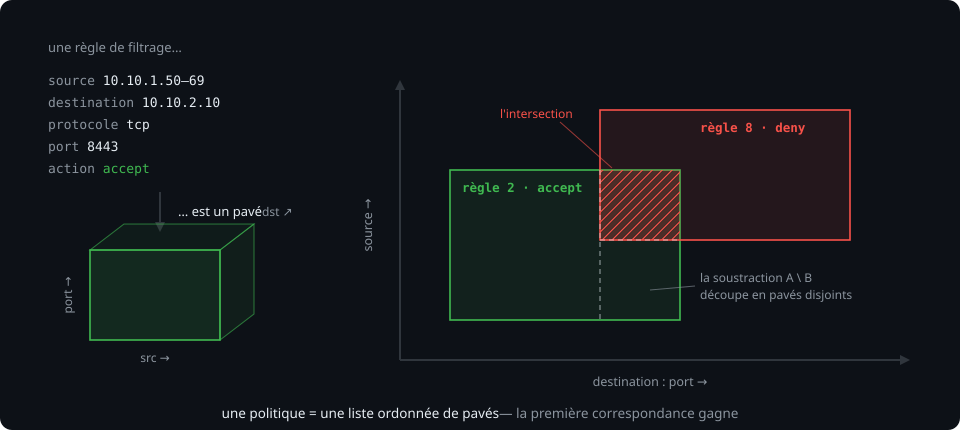

# Calque

[](https://github.com/yannbanas/calque/actions/workflows/ci.yml)
[](LICENSE)
[](https://rustup.rs)

<p align="center">
  
</p>

**Calque** est un outil en ligne de commande qui lit les configurations d'équipements
réseau (pare-feux, routeurs), en construit un modèle formel, et répond à deux
questions :

> **« Qui peut joindre quoi ? »** — et — **« Qu'est-ce qui casse si j'applique ce changement ? »**

Sans rien envoyer sur le réseau. Sans rien modifier. À partir des seuls fichiers
de configuration.

```bash
calque import --dir ./configs/                    # importer les configurations (détection auto)
calque path 10.0.10.5 '->' 10.0.20.10:445/tcp     # ce flux passe-t-il, et pourquoi ?
calque test --flows flows.yaml                    # exécuter la suite de tests du réseau
calque plan --candidate fw-01-nouveau.conf        # prévisualiser un changement AVANT de l'appliquer
```

Chaque verdict est **justifié** : la règle exacte qui décide, avec le fichier et
la ligne d'origine (`refusé par la règle 34, fichier fw-01.conf ligne 812`).
Un verdict sans justification ne vaut rien.

---

## Pourquoi

Les erreurs de segmentation réseau ne se voient pas : une règle insérée au
mauvais endroit, un groupe d'adresses trop large, une politique qui en masque
une autre — et un accès s'ouvre sans que personne ne l'ait demandé. Les
équipements eux-mêmes ne répondent jamais à « pourquoi ce flux passe-t-il ? ».

Calque traite la configuration réseau comme du code :

- **`calque test`** est la suite de tests du réseau — un fichier `flows.yaml`
  déclare les flux attendus (autorisés et interdits), et l'outil rend un code
  de sortie non nul si la réalité diverge. Branchable tel quel dans une chaîne
  d'intégration continue ou un crochet Git.
- **`calque plan`** est le `terraform plan` du pare-feu — il compare la
  configuration courante et une candidate, et liste les flux qui changent de
  comportement, y compris les ouvertures **que personne n'avait demandées**.
- **`calque path --explain`** rend la trace complète, saut par saut, décision
  par décision — y compris `shadowed_by` : « votre règle d'autorisation est
  masquée par la règle 12, ligne 340 », la réponse à la question qui fait
  perdre le plus de temps aux administrateurs.

<p align="center">
  
</p>

## Ce qui distingue Calque

**Le cœur est pur.** Les crates d'analyse (`calque-model`, `calque-space`,
`calque-engine`, `calque-policy`, `calque-diff`) ne dépendent ni de `tokio`,
ni du réseau, ni du système de fichiers, ni de l'horloge. Données en entrée,
données en sortie. Résultat : un moteur testable exhaustivement (dizaines de
milliers de cas par seconde), **reproductible** — indispensable quand la sortie
sert de preuve — et rapide. Cette règle est vérifiée en intégration continue
(`scripts/check-purity.sh` / `.ps1`).

**Ne jamais deviner.** Une directive non comprise produit un diagnostic, jamais
une supposition. Toute sortie porte son niveau de fidélité (`Complete` ou
`Partial` avec la liste de ce qui n'a pas été compris), et l'outil **refuse de
rendre un verdict ferme** sur un modèle partiel touchant le chemin analysé. Une
réponse « autorisé » issue d'un modèle qui a ignoré trois directives est pire
que pas de réponse.

**Lecture seule, toujours.** Calque ne pousse jamais une configuration. C'est
simultanément l'argument de confiance, la limitation de responsabilité et la
réduction de surface d'attaque.

**Une algèbre inspectable plutôt qu'un solveur.** Une règle de pare-feu est un
pavé dans un espace à cinq dimensions (source, destination, protocole, ports).
Calque implémente l'algèbre des ensembles de pavés (union, intersection,
soustraction, normalisation) — quelques centaines de lignes, rapides sur les
tailles réelles, et dont les résultats se lisent. Les diagrammes de décision
binaires restent une optimisation possible de v2, derrière le trait
`HeaderSpace` ([ADR 001](docs/adr/001-representation-par-paves.md)).

<p align="center">
  
</p>

---

## Démarrage rapide

Prérequis : [Rust stable](https://rustup.rs).

```bash
git clone https://github.com/yannbanas/calque
cd calque
cargo build --workspace --release
# le binaire : target/release/calque
```

Ou via l'image Docker publiée sur GHCR à chaque commit sur `main`
(statique, sans shell — l'outil lit et écrit uniquement dans le
répertoire monté sur `/work`) :

```bash
docker run --rm -v "$PWD:/work" ghcr.io/yannbanas/calque import fw-01.conf
docker run --rm -v "$PWD:/work" ghcr.io/yannbanas/calque test --flows flows.yaml
```

### La suite de tests du réseau

`flows.yaml` déclare ce que le réseau doit faire — c'est un contrat versionnable :

```yaml
flows:
  - name: la comptabilité accède au serveur de fichiers
    from: 10.0.10.0/24
    to:   10.0.20.5
    port: 445/tcp
    expect: allow

  - name: le wifi invité est isolé de l'administration
    from: vlan-invite
    to:   vlan-admin
    port: any
    expect: deny
```

```bash
calque test                     # sortie texte, code de sortie ≠ 0 si un flux dévie
calque test --format junit      # pour l'intégration continue
```

### Prévisualiser un changement

`calque plan` compare la configuration courante et une candidate, et liste les
flux qui changent de comportement — **avant** d'appliquer quoi que ce soit :

<p align="center">
  
</p>

```text
$ calque plan --candidate fw-01-nouveau.conf

2 flux change(nt) de comportement :

  ROMPU    la comptabilité accède au serveur de fichiers
           10.0.10.0/24 → 10.0.20.5:445/tcp
           avant : autorisé par la règle 12 (fw-01.conf ligne 120)
           après : refusé par la règle 8 (fw-01-nouveau.conf ligne 80)

  CORRIGÉ  le wifi invité est isolé de l'administration
           vlan-invite → vlan-admin
           avant : autorisé à tort
           après : refusé (conforme à l'attente)

  NOUVEAU  10.0.30.0/24 → 10.0.20.0/24:80/tcp devient joignable
           10.0.30.1 → 10.0.20.1:80/tcp
           n'était couvert par aucun flux déclaré

1 flux inchangé(s).
```

### Vérifier ce que l'outil a compris

```bash
calque import fw-01.conf --as fw-01
calque model check              # fidélité du modèle : directives non gérées, avec fichier + ligne
calque topology check           # liens ambigus ou manquants
```

---

## Architecture

Deux couches d'analyse, jamais une : la couche 1 ne connaît que le **format**
(blocs FortiGate, indentation IOS, XML…), la couche 2 porte la **sémantique**
du constructeur. Le moteur, lui, ne voit que la représentation intermédiaire.

<p align="center">
  
</p>

| Crate | Rôle | Pureté |
|---|---|---|
| [`calque-model`](crates/calque-model) | Représentation intermédiaire : équipements, interfaces, routes, règles avec traçabilité (`SourceSpan`), objets résolus tard | **PUR** |
| [`calque-space`](crates/calque-space) | Algèbre d'espace d'en-têtes : pavés 5D, union/intersection/soustraction normalisées, IPv4 + IPv6 | **PUR** |
| [`calque-engine`](crates/calque-engine) | Moteur d'accessibilité concret : localisation, filtres, NAT, routage par plus long préfixe, détection de boucles, traces avec `shadowed_by` | **PUR** |
| [`calque-policy`](crates/calque-policy) | Le format `flows.yaml` et les invariants | **PUR** |
| [`calque-diff`](crates/calque-diff) | Comparaison structurelle de deux modèles (fondation de `calque plan`) | **PUR** |
| [`calque-parse`](crates/calque-parse) | Couche 1 : tokenizers FortiGate (blocs) et Cisco IOS (indentation), spans exacts | PUR |
| [`calque-vendors`](crates/calque-vendors) | Couche 2 : sémantique constructeur → représentation intermédiaire | PUR |
| [`calque-report`](crates/calque-report) | Rendus : texte, JSON, JUnit | — |
| [`calque-cli`](crates/calque-cli) | Le binaire `calque` | — |

La règle de dépendance : les crates purs ne voient que d'autres crates purs.
La future collecte en ligne (`calque-collect`, SSH/LLDP) sera une fonctionnalité
Cargo optionnelle, désactivée par défaut.

## Validation

Un modèle faux est pire qu'aucun modèle. Quatre niveaux de défense :

| Niveau | Outil | Ce qu'il attrape |
|---|---|---|
| Propriétés | `proptest` sur l'algèbre (lois des ensembles, cohérence symbolique/concret) | erreurs d'algèbre |
| Instantanés | `insta` sur les analyseurs | régressions silencieuses d'analyse |
| Corpus | configurations anonymisées + réponses attendues ([corpus/](corpus/)) | erreurs de sémantique constructeur |
| Confrontation au réel | `calque verify --against-reality` (à venir) : tester réellement les flux et comparer au modèle | tout le reste |

## État et feuille de route

**v0, en développement actif.** La spécification est stable
([CALQUE-ARCHITECTURE.md](CALQUE-ARCHITECTURE.md)). Le MVP fonctionne de bout
en bout sur FortiGate (`import` → `model check` → `path --explain` → `test` →
`plan` → `topology check`), couvert par des tests de bout en bout sur le
corpus. Pas encore éprouvé sur des configurations de production — les retours
de terrain sont bienvenus.

| Étape | Contenu | État |
|---|---|---|
| S1 | Analyse FortiGate, représentation intermédiaire, `import`, `model check` | ✅ |
| S2 | Algèbre de pavés, moteur concret, `path --explain` | ✅ |
| S3 | `flows.yaml`, `calque test`, sortie JUnit | ✅ |
| S4 | `calque plan` — la prévisualisation de changement (ouvertures non demandées détectées par sondes, exhaustivité au S6) | ✅ |
| — | Topologie v1 : inférence par sous-réseau, `topology.yaml`, `topology check` | ✅ |
| S5 | Deuxième constructeur : Cisco IOS | ⏳ (tokenizer prêt) |
| S6 | Mode symbolique : `calque reach`, règles mortes et masquées | ⏳ |
| S7 | Collecte SSH, voisinage LLDP, découverte de topologie | ⏳ |

Constructeurs visés, dans l'ordre : **FortiGate**, Cisco IOS/IOS-XE,
pfSense/OPNsense, nftables, puis HPE/Aruba et UniFi. Un constructeur
parfaitement traité vaut mieux que six approximatifs.

## Contribuer

Les contributions sont bienvenues — en particulier des configurations de test
**anonymisées** pour le corpus (lire impérativement
[corpus/README.md](corpus/README.md) : jamais de configuration réelle non
anonymisée, autorisation écrite obligatoire).

```bash
cargo test --workspace           # tout doit rester vert
cargo fmt --all && cargo clippy --workspace --all-targets
bash scripts/check-purity.sh     # le cœur doit rester pur
```

Les décisions d'architecture sont documentées et datées dans
[docs/adr/](docs/adr/).

## Documentation

- [CALQUE-ARCHITECTURE.md](CALQUE-ARCHITECTURE.md) — la spécification complète : représentation intermédiaire, algèbre de pavés, moteur, analyseurs, validation, feuille de route.
- [docs/adr/](docs/adr/) — les décisions d'architecture, dont [ADR 001](docs/adr/001-representation-par-paves.md) (pavés plutôt que diagrammes de décision binaires).
- [flows.example.yaml](flows.example.yaml) — exemple de suite de tests de flux.

## Licence

[Apache-2.0](LICENSE) — © 2026 Yann Banas.
